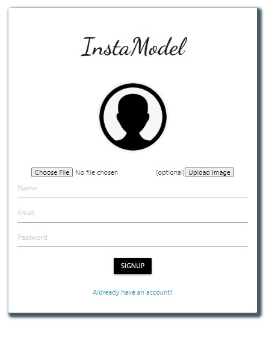
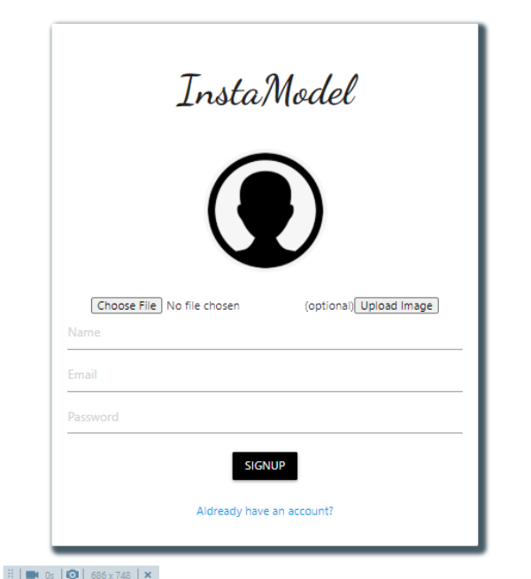

## InstaModel

This is backend of an application used to post and delete images, built with Nodejs,express,mongoDB.Frontend is built with React, Redux, JavaScript,materialize, and CSS.
Other features includes profile view,comments and likes.(Note:Access is not given to delete others post)

## Project Screen Shots  

## Installation and Setup Instructions

Clone down this repository. You will need `node` and `npm` installed globally on your machine.  

Installation:

`npm install`  

To Run Test Suite:  

`npm test`  

To Start Server:

`npm start`  

To Visit App:

`localhost:3000/`
